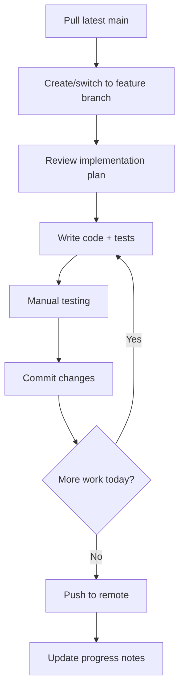

# Project Management Guide

**Project:** Bolt.new Feature Development  
**Timeline:** Q1 2025  
**Methodology:** Agile with 2-week sprints

---

## 📁 Documentation Structure

```
bolt.new/
├── FEATURE_ROADMAP.md          # Strategic feature list (what to build)
├── docs/
│   ├── PROJECT_MANAGEMENT.md   # This file (how to manage)
│   └── implementation/
│       ├── QUICK_WINS_PLAN.md  # Detailed plans for Priority 1 features
│       ├── GIT_INTEGRATION_PLAN.md     # (Create when ready)
│       ├── COLLABORATION_PLAN.md       # (Create when ready)
│       └── AI_ENHANCEMENTS_PLAN.md     # (Create when ready)
```

---

## 🎯 Getting Started Workflow

### Step 1: Choose Your Starting Point

**Option A: Quick Wins First (Recommended)**
- Start with 5 high-impact, low-effort features
- Ships features in 3-4 weeks
- Builds momentum and confidence
- **Start here if:** You want fast results

**Option B: Major Initiative First**
- Pick one complex feature (Git, Collaboration, etc.)
- Deep focus for 4-6 weeks
- Significant competitive advantage
- **Start here if:** You have specific user demand

**Option C: Custom Path**
- Mix features based on your priorities
- Balance quick wins with major features
- **Start here if:** You have unique constraints

### Step 2: Set Up Your Environment

```bash
# Ensure dependencies are up to date
pnpm install

# Create feature branch
git checkout -b feature/multi-model-ai

# Set up environment variables
cp .env.example .env.local
# Add your API keys

# Run development server
pnpm run dev
```

### Step 3: Create Feature Branches

Use this naming convention:
```
feature/multi-model-ai
feature/enhanced-terminal
feature/project-templates
feature/prompt-library
feature/project-export
```

### Step 4: Follow Implementation Plan

1. Open `docs/implementation/QUICK_WINS_PLAN.md`
2. Find your feature section
3. Follow day-by-day breakdown
4. Check off tasks as you complete them

---

## 📊 Sprint Planning

### Sprint Structure (2 weeks)

#### Week 1: Development
- **Day 1-2:** Foundation & setup
- **Day 3-4:** Core functionality
- **Day 5:** Code review & feedback

#### Week 2: Polish & Ship
- **Day 1-2:** Bug fixes & refinement
- **Day 3-4:** Testing & documentation
- **Day 5:** Deploy & monitor

### Sprint Ceremonies

#### Monday: Sprint Planning (1 hour)
- Review FEATURE_ROADMAP.md
- Select features for sprint
- Break down into tasks
- Assign work

#### Wednesday: Mid-Sprint Check (30 min)
- Progress review
- Blocker discussion
- Adjust scope if needed

#### Friday: Sprint Review & Retro (1 hour)
- Demo completed features
- Gather feedback
- Retrospective discussion
- Plan next sprint

---

## 🔄 Development Workflow

### Daily Routine



### Code Quality Checklist

Before each commit:
```bash
# Type check
pnpm run typecheck

# Lint
pnpm run lint

# Test
pnpm test

# Format (if you have prettier)
pnpm run format
```

### Git Commit Messages

Follow conventional commits:
```
feat: add multi-model AI selector component
fix: resolve terminal tab switching issue
docs: update implementation plan for templates
refactor: extract prompt definitions to separate files
test: add tests for project export functionality
```

---

## 📋 Task Tracking

### Option 1: Markdown Checkboxes (Simple)

Create a file: `docs/SPRINT_CURRENT.md`

```markdown
# Sprint 1: Quick Wins (Jan 15-29)

## Feature 1: Multi-Model AI Support
- [x] Set up OpenAI provider
- [x] Create model selector component
- [ ] Add cost tracking
- [ ] Write tests
- [ ] Documentation

## Feature 2: Enhanced Terminal
- [ ] Update terminal store
- [ ] Create tab component
- [ ] Implement keyboard shortcuts
```

### Option 2: GitHub Issues (Better for teams)

Create issues for each feature:
```
Title: [Feature] Multi-Model AI Support
Labels: enhancement, priority-high, quick-win

Description:
Implement multi-model AI support as described in Quick Wins Plan.

Tasks:
- [ ] Backend: Provider abstraction
- [ ] Backend: Update stream handler
- [ ] Frontend: Model selector UI
- [ ] Frontend: Settings persistence
- [ ] Testing: All providers work
- [ ] Docs: Update README

Acceptance Criteria:
- Users can switch between 3+ models
- API keys validated properly
- Model preference persists
```

### Option 3: GitHub Projects (Best for tracking)

Set up a project board:
```
Columns:
- 📋 Backlog
- 🎯 Ready
- 🔨 In Progress
- 👀 In Review
- ✅ Done

Move issues through workflow
```

---

## 🧪 Testing Strategy

### Test Levels

#### 1. Unit Tests (Required)
```typescript
// app/lib/export/project-exporter.spec.ts
describe('ProjectExporter', () => {
  it('should exclude node_modules from export', () => {
    // Test implementation
  });
});
```

Run: `pnpm test`

#### 2. Integration Tests (Recommended)
```typescript
// Test WebContainer interactions
// Test API endpoints
```

#### 3. E2E Tests (Optional for now)
```typescript
// Test full user flows
// Use Playwright or Cypress
```

#### 4. Manual Testing (Always)
- Test in development mode
- Test production build
- Test in different browsers
- Test on different screen sizes

### Test Coverage Goals
- **Critical paths:** 80%+ coverage
- **UI components:** 60%+ coverage
- **Utilities:** 90%+ coverage

---

## 🚀 Deployment Process

### Development Deployment
```bash
# Run local dev server
pnpm run dev

# Test production build locally
pnpm run preview
```

### Staging Deployment (if available)
```bash
# Build project
pnpm run build

# Deploy to staging
wrangler pages deploy --branch=staging
```

### Production Deployment
```bash
# Merge to main
git checkout main
git merge feature/multi-model-ai

# Deploy
pnpm run deploy

# Monitor
# Check error logs
# Monitor user feedback
```

---

## 📈 Progress Tracking

### Weekly Progress Report Template

Create: `docs/progress/YYYY-MM-DD.md`

```markdown
# Weekly Progress Report - Week of Jan 15

## Completed This Week
- ✅ Multi-model AI backend implementation
- ✅ Model selector UI component
- ✅ Terminal tabs functionality

## In Progress
- 🔄 Project templates system
- 🔄 Testing multi-model AI

## Blocked
- ❌ OpenAI API key approval (waiting on admin)

## Next Week Plan
- Complete project templates
- Start prompt library
- Deploy multi-model AI to staging

## Metrics
- Lines of code: +2,500
- Tests added: 15
- Bugs fixed: 3
- Features shipped: 1.5 / 5

## Notes
- Model switching works great
- Need to optimize template loading time
```

### Metrics to Track

```markdown
## Development Velocity
- Features completed per sprint
- Story points completed
- Bugs introduced vs. fixed

## Code Quality
- Test coverage percentage
- TypeScript errors count
- Linting warnings count

## Performance
- Bundle size changes
- Load time metrics
- WebContainer boot time

## User Impact (post-launch)
- Feature adoption rate
- User feedback sentiment
- Support tickets related to new features
```

---

## 🎓 Best Practices

### Code Organization
```
app/
├── components/          # React components
│   ├── chat/           # Chat-related components
│   ├── workbench/      # IDE components
│   ├── settings/       # Settings UI
│   └── templates/      # New: Template components
├── lib/
│   ├── .server/        # Server-only code
│   │   └── llm/        # AI/LLM logic
│   ├── stores/         # State management
│   ├── hooks/          # React hooks
│   ├── templates/      # New: Template system
│   ├── prompts/        # New: Prompt library
│   └── export/         # New: Export logic
└── routes/             # Remix routes
```

### File Naming
- Components: `PascalCase.tsx`
- Utilities: `kebab-case.ts`
- Tests: `*.spec.ts` or `*.test.ts`
- Types: `types.ts` or `*.types.ts`

### Import Organization
```typescript
// 1. External dependencies
import { useState } from 'react';
import { useStore } from '@nanostores/react';

// 2. Internal dependencies
import { workbenchStore } from '~/lib/stores/workbench';
import { Button } from '~/components/ui/Button';

// 3. Types
import type { ProjectTemplate } from '~/lib/templates/types';

// 4. Styles (if any)
import './styles.css';
```

### Component Structure
```typescript
// 1. Types
interface Props {
  title: string;
}

// 2. Component
export function MyComponent({ title }: Props) {
  // 3. Hooks
  const [state, setState] = useState();
  
  // 4. Effects
  useEffect(() => {}, []);
  
  // 5. Handlers
  const handleClick = () => {};
  
  // 6. Render
  return <div>{title}</div>;
}
```

---

## 🤝 Collaboration Guidelines

### Code Review Process
1. **Create PR with template**
   ```markdown
   ## Changes
   - Added multi-model AI support
   - Created model selector component
   
   ## Testing
   - [x] Tested with OpenAI
   - [x] Tested with Anthropic
   - [x] Tested model switching
   
   ## Screenshots
   [Add screenshots]
   
   ## Related Issues
   Closes #123
   ```

2. **Request review**
   - Tag relevant reviewers
   - Provide context
   - Highlight areas needing attention

3. **Address feedback**
   - Respond to all comments
   - Make requested changes
   - Re-request review

4. **Merge when approved**
   - Squash and merge (keep history clean)
   - Delete feature branch

### Communication
- **Daily updates:** Post in team chat
- **Blockers:** Raise immediately
- **Questions:** Ask early, don't struggle alone
- **Wins:** Celebrate progress!

---

## 🆘 Troubleshooting

### Common Issues

#### Issue: WebContainer not loading
```bash
# Clear cache
rm -rf node_modules/.cache
pnpm run dev
```

#### Issue: Type errors after adding new feature
```bash
# Regenerate types
pnpm run typegen
pnpm run typecheck
```

#### Issue: Tests failing
```bash
# Run single test file
pnpm test -- path/to/test.spec.ts

# Run with debugging
pnpm test -- --reporter=verbose
```

#### Issue: Build fails
```bash
# Clean build
rm -rf build
pnpm run build

# Check for errors
pnpm run typecheck
pnpm run lint
```

---

## 📚 Additional Resources

### Documentation
- [Remix Docs](https://remix.run/docs)
- [WebContainer API](https://webcontainers.io/api)
- [AI SDK Docs](https://sdk.vercel.ai/docs)
- [CodeMirror Docs](https://codemirror.net/)

### Tools
- [Warp Terminal](https://warp.dev) - The terminal you're using!
- [GitHub Copilot](https://github.com/features/copilot) - AI pair programming
- [TypeScript Playground](https://www.typescriptlang.org/play) - Test code
- [Ray.so](https://ray.so) - Beautiful code screenshots

### Learning
- [Bolt.new Architecture](./WARP.md) - Understand the codebase
- [Feature Roadmap](../FEATURE_ROADMAP.md) - See the big picture
- [Quick Wins Plan](./implementation/QUICK_WINS_PLAN.md) - Detailed implementation

---

## 🎯 Next Steps

### For Solo Developers
1. ✅ Read this document
2. ✅ Review FEATURE_ROADMAP.md
3. ✅ Choose starting feature from Quick Wins
4. ✅ Open QUICK_WINS_PLAN.md
5. ✅ Create feature branch
6. ✅ Start coding!

### For Teams
1. ✅ Team kickoff meeting
2. ✅ Review roadmap together
3. ✅ Assign features to team members
4. ✅ Set up project board
5. ✅ Schedule daily standups
6. ✅ Begin Sprint 1

---

## ✅ Success Criteria

You'll know you're on track when:
- [ ] You ship your first feature in 1-2 weeks
- [ ] Code review process is smooth
- [ ] Tests are passing consistently
- [ ] Documentation stays up to date
- [ ] Users notice and appreciate new features
- [ ] You're excited to build the next feature!

---

**Questions?** Create an issue or reach out to the team.

**Good luck building! 🚀**
